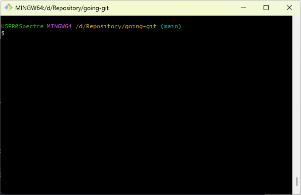

# Belajar Git dan GitHub

1. Membuat akun di GitHub
2. Install GIT https://git-scm.com/downloads
3. Pastikan Git mengenali dengan perintah berikut:
    git config --global user.name "nama_user"
    git config --global user.email "nama@email.com"
4. Pastikan posisi saat ini sudah di lokal atau folder yang akan digunakan untuk Git dan GitHub, atau membuat folder terlebih dahulu.
5. jalankan Git BASH 
6. git init
7. git clone "link https://...."
8. git status
9. ls -la
10. Membuat direktory - mkdir nama_direktory
11. Membuat file README.md - touch README.md
12. Membuat file lainnya index.html - touch index.html
13. git add .
14. git commit -m 'initial commit'
15. git push -u origin main
16. cek di GitHub dengan melakukan refresh pada halaman GitHub

